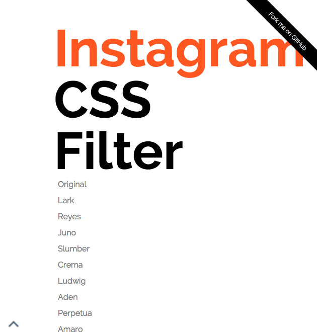

# About

**Instagram JS Filter** is a JS libary for realising Instagram Filters on the web.

## Demo

http://kenju.github.io/instagram_js_filter

<a href="http://kenju.github.io/instagram_js_filter"></a>

## Tech-background

As for image-processing, `canvas` is used for generating filtered images. RGB + alpha valus of each pixels of an image is converted for the targeted effects.

Such image-processing requires high memory-usage and could block user-experience, therefore `Web Worker API` is used for realising multi-thread processing in the client side.

# Install

## Download

Downloads zipped files from [the Github repository](https://github.com/KENJU/instagram_css_filter/tree/master/dist).

## Bower

```bash

$ bower install instagram_js_filter

```

## NPM

```bash

$ npm install instagram_js_filter

```


# Usage

There are easy 3 steps to use this library.

## 1. Downloads JS files

What you need is these files in `js` directory in [the GitHub reposizoty](https://github.com/KENJU/instagram_css_filter/tree/master/js).

- `filter.canvas.js` - e.g. creates canvas
- `filter.js` - main script file
- `lagrange.js` - calculate rgb based on lagrange's interpolating function for achieving instagram filter effects
- `worker.filter.js` - supplies all effects
- `worker.js` - convert rgb values in background thread
- `worker.util.js` - e.g. converts between rgb and hsl

## 2. Imports in HTML files

What you need is to import **2 JS files**.

Inside the code, `filter.js` calls `worker.js`, and the `worker.js` is importing `worker.util.js`, `legrange.js`, and `worker.filter.js`.

Threfore, **all scripts file should be in the same diretory** (unless you overwrite raw codes);

```html

<script src="js/filter.js"></script>
<script src="js/filter.canvas.js"></script>


```

## 3. Adds `data-effect="?"` attributes to `` tags

Firstly, add `data-effect="?"` attributes to `` tags which you want to apply the filters.

```html


```

## Available effects

- Instagram filters
	- lark
	- reyes
	- juno
	- slumber
	- crema
	- ludwig
	- aden
	- perpetua
	- amaro
	- mayfair
	- rise
	- hudson
	- valencia
	- xpro2
	- sierra
	- willow
	- lofi
	- earlybird
	- brannan
	- inkwell
	- hefe
	- nashville
	- sutro
	- toaster
	- walden
	- nineteenSeventySeven
	- kelvin
- Basic filters
	- grayscale
	- sepia
	- luminance
	- brighten
	- darken
	- opacity
	- negaposi
	- brightnessContrast
	- huerotate
	- saturate
	- horizontalFlip
	- verticalFlip
	- doubleFlip
	- horizontalMirror
	- verticalMirror
	- XYMirror

# License

Created by and copyright Kenju Wagatsuma Released under the [MIT license](https://github.com/KENJU/instagram_css_filter/blob/master/LICENSE).